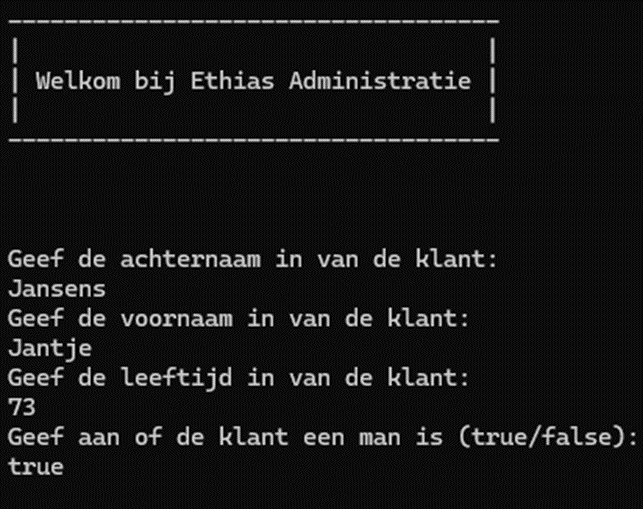
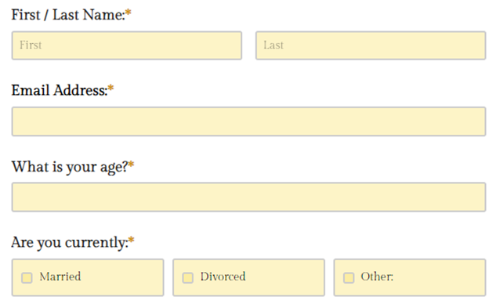

# Labo 2 - Variabelen en Operatoren

Het registratieformulier van Ethias werkt niet meer. Er is aan jou gevraagd om een tijdelijke vervanging te programmeren in een Console programma.

## Deel 1 - Groet
Voorzie een programma dat door de verzekeringsmaatschappij Ethias gebruikt kan worden om klanten te registreren.
Maak één variabele aan, genaamd groet:
- Zorg er voor dat je groet meerdere regels lang is
- Druk de groet af, zodra het programma start
	
	

## Deel 2 - Registratieformulier
Nadat de welkomsgroet getoond is, vraagt het programma om gegevens van de klant in te geven voor registratie.
Maak een variabele voor elk van de volgende klantengegevens:
- Voornaam
- Achternaam
- Leeftijd
- IsMan (waar of niet waar)
- Telefoonnummer

## Deel 3 - Verslag printen
Nadat het programma alle gegevens heeft ontvangen van de klant wordt er een samenvatting afgedrukt in de console.
Gebruik string interpolatie om de variabelen te injecteren in een samenvatting. Zorg er voor dat je samenvatting uitlijning bevat.

## Deel 4 - TryParse
Pas je Ethias registratie programma aan, zodat het niet meer kan crashen wanneer er ongeldige input wordt ingegeven. Gebruik TryParse om je waardes te converteren.